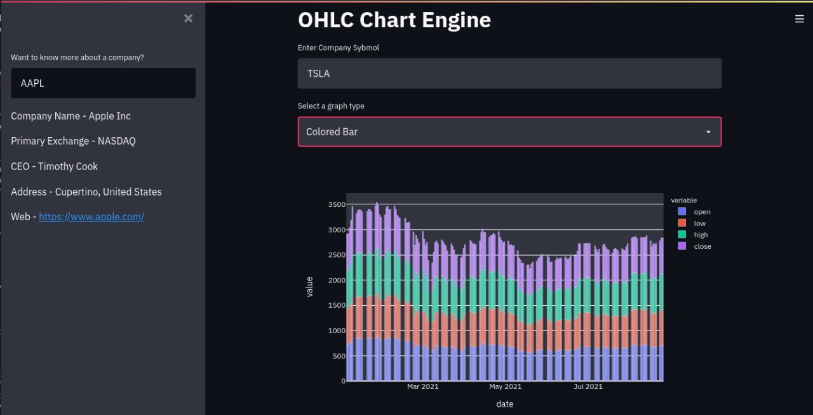

<!-- TABLE OF CONTENTS -->
<details open="open">
<summary>Table of Contents</summary>
<ol>
<li>
<a href="#about-the-project">About The Project</a>
<ul>
<li><a href="#built-with">Built With</a></li>
</ul>
</li>
<li>
<a href="#getting-started">Getting Started</a>
<ul>
<li><a href="#prerequisites">Prerequisites</a></li>
</ul>
</li>
<li><a href="#contributing">Contributing</a></li>
<li><a href="#contact">Contact</a></li>
</ol>
</details>

<!-- ABOUT THE PROJECT -->

## About The Project



In this project we create a Dashboard based on which User would be able to analyze the sentiment of the specific stock. We can create an Analytical Server "OHLC" (Open/High/Low/Close) time series based on the ‘Stock List’.

The special features are:

1. User can have the ability to search the different stocks based on the symbols and view the chart.
2. Users can filter the stock’s performance on specific date range
3. Users can view the history of their searches.
4. Users can switch between OHLC, Candlestick charts, Colored Bar, Vertex Line and Hollow Candle.
5. User can see additional information about selected company. You can use this free resource to get company information by ticker symbol or use any other free API available on internet

### Built With

This is built with the help of the below mentioned major libraries and also minor libraries which can be found in the Prerequisites section below .

- [Python](https://www.python.org/)
- [Streamlit](https://streamlit.io/)
- [pyEX](https://pypi.org/project/pyEX/)

<!-- GETTING STARTED -->

## Getting Started

This is an example of how you may give instructions on setting up your project locally.
To get a local copy up and running follow these simple example steps.

### Prerequisites

This is an example of how to list things you need to use the software and how to install them.

- Pandas

  ```
  import Pandas as pd
  ```

- csv

  ```
  import csv
  ```

- plotly - express, graph & objects

  ```
  $ pip install plotly==5.3.1
  import plotly.graph_objects as go
  from plotly import graph_objs as go
  import plotly.express as px
  ```

- streamlit

  ```
  pip install streamlit
  import streamlit as st
  ```

- pyEX [API]

  ```
  pip install pyEX
  import pyEX as p
  ```

<!-- USAGE EXAMPLES -->

## Contributing

Contributions are what make the open source community such an amazing place to learn, inspire, and create. Any contributions you make are **greatly appreciated**.

1. Fork the Project
2. Create your Feature Branch
3. Commit your Changes
4. Push to the Branc
5. Open a Pull Request

<!-- CONTACT -->

## Contact

Debashish Phukon - [debasish010@gmail.com](mailto:debasish010@gmail.com)

Sidhesha Kaurav - [sidheshak@gmail.com](mailto:sidheshak@gmail.com)

Sneh Shah - [ss17devil@gmail.com](mailto:ss17devil@gmail.com)

Yash Jain - [yjain9501@gmail.com](mailto:yjain9501@gmail.com)

Ameya Kulkarni - [ameya.2000k@gmail.com](mailto:ameya.2000k@gmail.com)

Project Link: [https://github.com/vivekjaipur/MIT-Team12](https://github.com/vivekjaipur/MIT-Team12)
# OHLC_Chart_Engine
